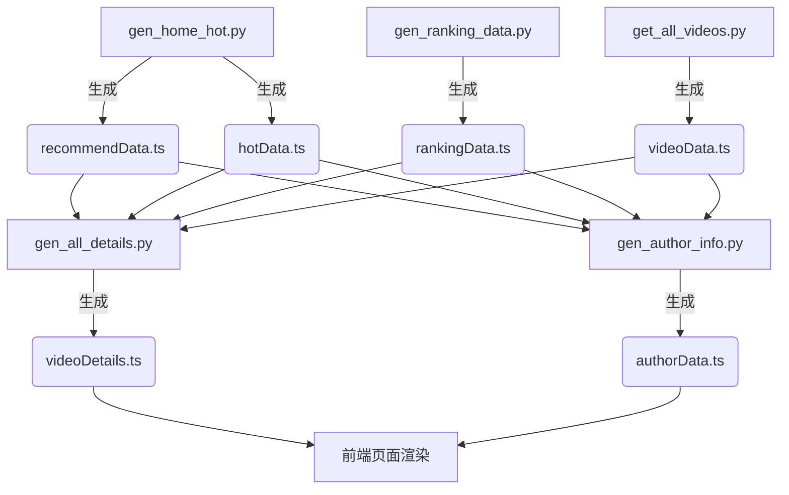

# Bilibili 数据爬取流程指南

本项目包含一套完整的 Python 脚本，用于从 Bilibili 获取模拟环境所需的真实数据。这些脚本协同工作，构建了一个包含视频列表、详细元数据、评论和 UP 主信息的完整数据集。

## 🛠️ 前置准备
1. 确保安装 `bilibili-api-python` 库。
2. 部分脚本可能需要 SESSDATA（在脚本头部配置 `Credential`），以提高访问限额或获取受限数据。

## 🚀 爬取流程 (建议按顺序执行)

### 第一阶段：获取视频源数据
首先需要获取视频列表（BVID），这些脚本会生成基础的数据文件，供后续阶段使用。

1. **首页推荐与热门视频**
   - 📜 脚本：`python bili_script/gen_home_hot.py`
   - 📂 输出：
     - `apps/Bilibili/data/recommendData.ts` (首页推荐流)
     - `apps/Bilibili/data/hotData.ts` (热门 Tab 数据)

2. **分区排行榜**
   - 📜 脚本：`python bili_script/gen_ranking_data.py`
   - 📂 输出：`apps/Bilibili/data/rankingData.ts` (包含各主要分区的 Top 10 视频)

3. **通用分区视频库**
   - 📜 脚本：`python bili_script/get_all_videos.py`
   - 🔍 功能：抓取各主要分区的最新视频（Top 50），作为应用的基础视频池（用于搜索、兜底展示等）。
   - 📂 输出：`apps/Bilibili/data/videoData.ts`
     - 包含大量普通视频数据。

### 第二阶段：获取视频详情
读取第一阶段生成的所有视频数据，补充该视频的详细属性。

3. **视频详情补充 (增量/断点续传)**
   - 📜 脚本：`python bili_script/gen_all_details.py`
   - 🔍 功能：扫描所有 `.ts` 数据文件，提取所有 BVID。抓取 **视频标签 (Tags)**、**实时在线人数**、**精选评论 (Top 20)**。
   - ⚡️ 特性：
     - **增量更新**：自动跳过 `videoDetails.jsonl` 中已存在的视频，仅抓取新出现的视频。
     - **实时保存**：数据实时写入临时文件，防止中断丢失。
   - 📂 输出：`apps/Bilibili/data/videoDetails.ts`
     - 包含 `VIDEO_TAGS`, `VIDEO_ONLINE`, `VIDEO_COMMENTS` 等导出。

### 第三阶段：获取 UP 主信息
分析所有视频的作者，构建用户个人主页所需的数据。

4. **UP 主详情抓取 (增量/后台运行)**
   - 📜 脚本：`python bili_script/gen_author_info.py`
   - 🔍 功能：提取所有视频的作者 MID。抓取 **粉丝数**、**获赞总数**、**关注数**、**最近投稿列表 (Top 12)**、**官方认证信息**、**个人简介**。
   - ⚡️ 特性：
     - **安全限速**：使用单线程 + 随机延迟策略，防止 IP 封禁。
     - **实时生成**：每抓取 10 个用户更新一次最终的 `.ts` 文件，前端可即时看到更新。
   - 📂 输出：`apps/Bilibili/data/authorData.ts`
     - 包含 `AUTHOR_DATA` 字典，Key 为 MID。

## 📂 数据文件依赖关系图

## ⚠️ 注意事项
- **关于封禁**：`gen_author_info.py` 涉及大量用户主页访问，极易触发风控。脚本已内置延迟，**请勿手动移除延迟代码**。
- **数据一致性**：如果删除了某个源数据文件（如 `rankingData.ts`），建议重新运行对应脚本生成，否则后续详情脚本可能无法索引到部分视频。
