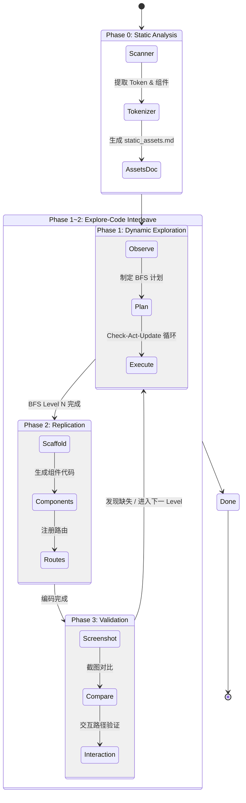

# Agent 驱动的数字孪生开发规范 (AD-DTDD Specification)

> **致 Agent**: 本文档不是功能介绍，而是你必须遵守的**操作规范 (Standard Operating Procedure)**。你的目标是**自主**、**无错**、**增量**地将 Android 应用复刻为 Web 应用。

---

## 1. 核心原则 (Core Principles)

1. **静态先行 (Static Analysis First)**：启动模拟器前，**必须**完整扫描反编译资源。如果一个组件或页面可以通过 XML 还原，严禁使用动态捕捉。
2. **设计令牌化 (Design Tokenization)**：优先从 `res/values/colors.xml` 和 `dimens.xml` 提取颜色、间距、圆角等数据，生成 Web 端的 Tailwind/CSS 主题配置，确保视觉基准一致。
3. **原子组件复用 (Atomic Component Reuse)**：通过扫描 `res/layout/item_*.xml` 识别列表项、气泡、卡片等重复单元。在复刻页面前，先建立这些"原子级"的 React 组件库。
4. **探索-编码交替 (Interleaved Explore-Code)**：不要一次性探索完所有页面。完成一个层级的探索后立即编码，带着编码中发现的问题再回去探索下一层级。
5. **可恢复性 (Resumability)**：所有中间产物必须持久化，确保 Agent 中断后可从断点恢复。

---

## 2. 标准工作流 (The Workflow Loop)



---

## 2.1 目录结构与产出物约定 (Hard Spec)

**规则**：本规范中所有相对路径，均以仓库根目录为基准。

### 2.1.1 输入目录（反编译产物）

- **反编译目录**：`decompiled/<AppName>_decompiled/`
  - **资源目录**：`decompiled/<AppName>_decompiled/res/`

### 2.1.2 输出目录（必须落盘，允许断点恢复）

- **探索与分析根目录**：`auto_explore/<AppName>/`
- **Trace 目录（脚本真实落盘位置）**：`auto_explore/<AppName>/traces/<Trace>/`
  - 其中 `<Trace>` **等价于** `scripts/agent_interact.py --session <Trace>`
  - `<StepName>` **等价于** `scripts/agent_interact.py --step-name <StepName>`

`auto_explore/<AppName>/` 下的**必须**产出物（缺一不可）：

- **静态分析**
  - `capability_map.json`：静态宏观能力图（`scripts/analyze_apk.py --output`）。
  - `static_assets.md`：Design Tokens + 原子组件索引 + Fast Path 资产清单。
- **动态探索（规划与状态机）**
  - `bfs_plan.md`：BFS 探索计划（Step 0 产出）。
  - `operation_logic.md`：状态节点与转移关系（Check-Act-Update 闭环实时更新）。
  - `errors.log`：脚本失败与人工回退记录（第 10 章要求）。
- **复刻/验证/恢复**
  - `validation_log.md`：验证记录（第 7 章要求）。
  - `checkpoint.json`：断点恢复检查点（第 8 章要求）。
- **探索过程数据（Trace）**
  - `traces/<Trace>/<StepName>/screenshot.png`：该步截图。
  - `traces/<Trace>/<StepName>/elements.xml`：该步 UI XML Dump。
  - `traces/<Trace>/<StepName>/elements_tree.json`：树形 UI（复刻核心输入）。
  - `traces/<Trace>/<StepName>/actionable_elements.json`：可交互元素列表（交互映射输入）。
  - `traces/<Trace>/<StepName>/action.json`：动作元数据（action/target_id/coords/text/desc/timestamp）。
  - `traces/<Trace>/<StepName>/assets/drawables/`：自动提取的 drawable/icon（若 `<AppName>` 配置了 `apk_res`，则会写入，并在 `elements_tree.json` 中以 `assets/drawables/...` 相对路径引用）。

> 约定：文档中出现的 `traces/` 如无特别说明，均指 `auto_explore/<AppName>/traces/<Trace>/`。

### 2.1.3 可选但推荐的可视化产物（可再生，不作为断点恢复依赖）

以下产物用于**人工快速排障/对齐**，可从 JSON/XML 重新生成，因此不纳入“必须产出物”。

- `layout_preview.html`
  - **来源**：
    - `scripts/agent_interact.py` 每个 step 会在 `traces/<Trace>/<StepName>/layout_preview.html` 自动生成（推荐）。
    - 或使用 `python scripts/dump_ui_layout.py --session ...` 的多屏采集流程时，在每个 `screen_XX/` 目录内生成。
  - **用途**：快速浏览屏幕元素框、层级与大致样式，便于定位“哪一块不对”。
- `web_mock.html`
  - **来源**：
    - `scripts/agent_interact.py` 每个 step 会在 `traces/<Trace>/<StepName>/web_mock.html` 自动生成（推荐）。
    - 或通过 `scripts/generate_web_mock.py` 从某个屏幕目录下的 `elements_tree.json` 再生。
  - **生成命令**（目标目录需包含 `elements_tree.json`，且格式为 `dump_ui_layout.generate_element_tree_json()` 生成的标准结构：包含 `screen` 与 `element_tree` 字段）：

```bash
python scripts/generate_web_mock.py <screen_dir>
```

---

## 3. 阶段零：静态普查与 Fast Path (Protocol: Static First)

### 3.1 全局脱混淆 (Universal Deobfuscation)

对于现代大型 App（如小红书），资源文件名往往被混淆为 `APKTOOL_DUMMYVAL_*`。在进行任何分析前，**必须**执行：

```bash
python scripts/deobfuscate_resources.py --dir decompiled/<AppName>_decompiled
```

* **原理**：该工作流不依赖脆弱的元数据，而是通过扫描 Smali 代码中的十六进制 ID，自动关联资源与其所在的 Activity/Fragment。
* **效果**：将 `APKTOOL_DUMMYVAL_0x7f...xml` 还原为 `XhsPayDialog.xml` 或 `PrivacySettingsActivity.xml`，瞬间开启 Fast Path 开关。
* **失败回退**：若脚本因 APK 加壳或资源加密而失败，记录为 `Blocked: deobfuscation_failed`，跳过 Fast Path，直接进入动态探索阶段。

### 3.2 静态宏观分析 (Macro Capability Analysis)

在深入通过 grep 搜索资源前，先运行全自动分析脚本获取全局视野：

```bash
python scripts/analyze_apk.py --decompiled-dir decompiled/<AppName>_decompiled --output auto_explore/<AppName>/capability_map.json
```

* **输入**：反编译目录。
* **输出**：`capability_map.json`。
* **价值**：
  * **Activity 角色推断**：自动识别哪些是 `EDITOR` (编辑页)、`SETTINGS` (设置页) 或 `AUTH` (登录页)。
  * **静态路由图**：不运行 App 就能知道 `MainActivity` 可能会跳转到哪些页面。
  * **入口识别**：列出所有 Launcher Activity。
* **失败回退**：若脚本报错，手动检查 `AndroidManifest.xml`，至少提取出 Activity 列表和 Launcher 入口。

### 3.3 识别 "Fast Path" 候选者

Agent 必须扫描并建立以下"资产索引"：

1. **设计令牌 (Design Tokens)**:
   * **Colors**: 扫描 `res/values/colors.xml` 和 `values-night/`。获取主色、背景色、文字色。
   * **Dimens**: 扫描 `res/values/dimens.xml`。获取 Padding, Margin, TextSize 数值。
2. **原子组件 (Atomic Components)**:
   * **List Items**: 扫描 `res/layout/item_*.xml` 或 `*_item.xml`。
   * **Bubbles**: 如 `Mms` 中的 `message_item_bubble_*.xml`。
   * **Action**: 提取组件的 ID 和对应的点击跳转逻辑 (通过 Smali 分析)。
3. **声明式页面 (Declarative Screens)**:
   * **Preferences**: `res/xml/preference_*.xml`。
   * **Dialogs**: `res/layout/*_dialog.xml`。
   * **Menu**: `res/menu/*.xml`。

### 3.4 Output: Static Assets Document

**必须**在 `auto_explore/<AppName>/static_assets.md` 中生成资产报告，包含：

* **Design Tokens**: 核心颜色 (#hex -> name) 和间距。
* **Atomic Components**:
  * `layout/item_*.xml` (List Items)
  * `xml/preference_*.xml` (Settings Logic)
  * `drawable/bg_*.xml` or `selector_*.xml` (Button States/Shapes)
  * `anim/*.xml` (Transitions)
  * `menu/*.xml` (Navigation Structures)

---

## 4. 特殊项：超级 App 挑战 (Tier 3: Super App Challenge)

当常规反编译在"加载资源表"阶段报错（如 `Could not find framework resources for package of id: 47`）时，标志进入超级 App 处理模式。

### 4.1 诊断与回退 (Diagnosis & Fallback)

1. **架构分片识别**：识别并合并 `split_config.*.apk`。若分片无代码，主攻 `base.apk`。
2. **二进制回退**：若资源解码崩溃，立即强制使用 `apktool d -r` (保留原始二进制资源)。
3. **清单恢复**：在 `-r` 模式下，需使用 `AxmlPrinter` 或类似工具手动解析 `AndroidManifest.xml.bin` 以获取 Activity 路由映射。

### 4.2 深度资产提取协议 (Deep Asset Extraction Protocol)

面对类似支付宝 BirdNest (鸟巢) 这种将 UI 逻辑隐藏在自研 DSL 中的架构：

* **资产重定向**：放弃 `res/layout`，转而全文检索 `assets/` 目录下的 `.json`, `.dsl`, 或加密格式。
* **提取脚本化**：编写专用 `*_resource_harvester.py`，将混淆的模板序列化为 React 可用的 JSON 结构。
* **存储规范**：所有提取出的资产统一存放在 `extracted_assets/<AppName>/`，该目录已在 `.gitignore` 中配置，用于 Agent 内部生产。

---

## 5. 阶段一：动态探索规范 (Protocol: Dynamic Exploration)

**适用场景**：无法静态还原的复杂页面。
**核心理念**：**Plan First, Act Second.** (先策划，后行动)。
**工具依赖**：`scripts/agent_interact.py` (集成了截图、Dump、元素提取、动作执行)。

### 5.1 Step 0: 战略观测与策划 (Strategic Observation & Planning)

在执行任何点击之前，Agent 必须先进行一次"静默观测"，并制定 BFS 探索计划。

1. **静默采集**：
   ```bash
   python scripts/agent_interact.py --app <AppName> --session <Trace> --step-name 00_init --action capture_only
   ```
2. **分析 UI 布局**：查看生成的 `screenshot.png`, `elements_tree.json` 和 `actionable_elements.json`。
3. **制定探索计划**：根据 APP 的功能架构，制定 **BFS (广度优先)** 策略。
   * **优先级梯度**：
     1. **一级导航 (Highest)**：底部 Tab 栏、顶部核心 Menu (侧边栏)。
     2. **核心内容 (High)**：列表项 (List Items)、Feed 流卡片。
     3. **功能入口 (Medium)**：搜索、设置、发布按钮。
     4. **详情页 (Low)**：点击列表项进入的二级页面 (通常结构重复，测几个即可)。
   * **产出物**：将计划写入 **`auto_explore/<AppName>/bfs_plan.md`**。

### 5.2 Step 1: 标准执行循环 (The Execution Loop)

Agent 必须严格遵守 **Check-Act-Update** 闭环：

#### 1. Check (原点校准)

* 读取 **`auto_explore/<AppName>/operation_logic.md`** (如果是首次则新建)。
* 确认当前所在的 `State` (通过 Hash 或视觉判断)。
* 从探索计划中取出下一个待探索的 `Target Element`。

#### 2. Act (执行动作)

* 使用 `agent_interact.py` 执行动作。**严禁**使用原始 `adb` 命令。
  ```bash
  python scripts/agent_interact.py --app <AppName> --session <Trace> \
    --step-name <StepID>_<ActionDesc> \
    --action tap \
    --target-id <ResourceID> \
    --desc "Tap 'Me' tab to switch to profile"
  ```
* *注：脚本会自动完成截图、XML Dump、元素提取 (`actionable_elements.json`) 和日志记录。*

#### 3. Update (文档同步) —— **CRITICAL**

* **立即**更新 `auto_explore/<AppName>/operation_logic.md`。**不要等到探索结束再写！**
* **记录内容**：
  * **State Node**: 新增发现的状态 (State B)。
  * **Transition**: 记录 `State A --[Tap Button X]--> State B`。
  * **Business Logic**: 简述该操作触发的业务逻辑 (如 "切换到底部 Tab 3，显示个人中心")。

### 5.3 退出与验收 (Convergence & Handoff)

* **完成标准**：当前 BFS Level 中的核心路径全部清空。
* **深度控制**：对于无限滚动的列表，仅采集 **首屏** 和 **滚动一次后的次屏** 即可，不要无限采集。
* **最终交付**：
  1. **`operation_logic.md`**：保存在 `auto_explore/<AppName>/` 下。
  2. **`bfs_plan.md`**：保存在 `auto_explore/<AppName>/` 下。
  3. **`traces/` 目录**：包含所有步骤的完整数据快照 (由脚本自动生成)。

### 5.4 迭代与编码切换 (Iterative Handoff)

**不要一次性探索完所有页面！**

* **Rule**: 当你完成了 **App 骨架 (Shell)** 和 **首页 (Home View)** 的探索（即 BFS 的 Level 1 & Level 2）后，**立即暂停探索**。
* **Action**: 进入 **Phase 2: Replication**，先把首页和导航写出来。
* **Reason**: 只有在写代码时，你才会发现缺少哪些细节。带着问题回来继续探索 (Level 3+) 会更高效。

---

## 6. 阶段二：复刻规范 (Protocol: Replication)

### 6.1 路径选择 (Path Selection)

根据数据来源选择复刻路径：

| 条件                                                    | 选择路径                   | 说明                             |
| ------------------------------------------------------- | -------------------------- | -------------------------------- |
| `static_assets.md` 中有对应的 XML 布局和 Design Token | **Static Path**      | 直接从 XML 结构 + Token 生成组件 |
| 只有动态探索截图和 DOM Dump、无法静态还原               | **Visual Path**      | 从截图 + DOM 推断还原            |
| 两者都有                                                | **Static Path 优先** | 用截图做视觉校准                 |

### 6.2 Static Path: 结构化复刻

**输入**：`static_assets.md` 中的 Design Tokens + XML 布局文件。

1. **主题配置生成**：
   * 从 `colors.xml` / `dimens.xml` 提取的 Token，写入项目的主题配置（如 `tailwind.config.js` 或 CSS Variables）。
   * 命名规范：`--color-brand-primary`, `--spacing-md`, `--radius-card` 等。
2. **组件映射**：
   * `<LinearLayout orientation="vertical">` → `<div className="flex flex-col">`
   * `<TextView>` → `<span>` / `<p>`
   * `<ImageView>` → `` / `<Icon>`
   * `<RecyclerView>` → 列表组件 + `map()` 渲染
   * `<SwitchPreference>` → `<SwitchPreference />` (自定义 React 组件)
   * `<PreferenceCategory>` → `<PreferenceCategory />` (自定义 React 组件)
3. **文案填充**：
   * 优先从 `values-zh-rCN/strings.xml` 提取中文文案。
   * 若无中文，回退到 `values/strings.xml` 英文。
   * 使用 `@string/key_name` 的 key 作为 React 组件的 prop 名。

### 6.3 Visual Path: 视觉推断复刻

**输入**：`traces/` 中的截图 + `elements_tree.json` + `actionable_elements.json`。

1. **布局推断**：从截图和 DOM 树推断 Flex 布局方向、间距、对齐方式。
2. **颜色采样**：从截图中采样颜色值，**但必须**与 `static_assets.md` 中的 Token 交叉验证（如果有的话）。
3. **交互映射**：从 `actionable_elements.json` 中提取可点击元素，映射为 `onClick` 事件。

### 6.4 代码规范 (Code Conventions)

* **目录结构**：每个 App 的页面存放在 `apps/<AppName>/pages/` 下，共享组件在 `apps/<AppName>/components/` 下。
* **命名约定**：
  * 页面文件：`<PageName>Page.tsx`（如 `SettingsPage.tsx`）
  * 组件文件：`<ComponentName>.tsx`（如 `PreferenceItem.tsx`）
* **路由注册**：每生成一个新页面，**必须立即**在对应的 App 路由配置中注册，并确保"返回键"逻辑在 Web 端同样有效。
* **严禁硬编码颜色**：如果 `colors.xml` 定义了 `#ff3482ff` 为 `brand_primary`，代码中必须使用 Token 变量，严禁直接写 hex 值。

### 6.5 增量编码原则 (Incremental Coding)

1. **先骨架后填充**：先生成页面的整体 Layout（导航栏、Tab 栏、内容区域占位），再逐个填充内容组件。
2. **先静态后动态**：先完成纯展示的 UI，再添加交互逻辑（点击跳转、状态切换）。
3. **立即可运行**：每次提交的代码必须可在 `npm run dev` 下正常运行，不允许留下编译错误。

---

## 7. 阶段三：验证规范 (Protocol: Validation)

### 7.1 视觉对比验证

每完成一个页面的复刻，**必须**进行视觉对比：

1. **原始参照**：使用 `traces/` 中的截图作为基准。
2. **Web 截图**：在浏览器中以移动端视口 (360x800) 截取 Web 版页面。
3. **对比标准**：
   * **布局结构**：元素排列顺序、层级关系是否一致。
   * **间距/尺寸**：偏差不超过 ±4dp。
   * **颜色**：主色调一致，允许 Alpha 通道的微小差异。
   * **文案**：文字内容完全一致。

### 7.2 交互路径验证

验证关键交互路径是否与原始 App 行为一致：

1. **导航路径**：Tab 切换、页面跳转、返回键行为。
2. **状态切换**：开关切换、选项选择等交互是否正确响应。
3. **边界情况**：空列表、长文本截断、加载态等。

### 7.3 验证记录

在 `auto_explore/<AppName>/validation_log.md` 中记录：

```markdown
## <PageName> 验证记录
- **日期**: YYYY-MM-DD
- **视觉对比**: ✅ 通过 / ⚠️ 偏差 (说明) / ❌ 不通过 (说明)
- **交互验证**: ✅ 通过 / ❌ 不通过 (说明)
- **待修复项**: [列表]
```

---

## 8. 断点恢复机制 (Resumability Protocol)

### 8.1 检查点文件 (Checkpoint)

Agent 必须维护 `auto_explore/<AppName>/checkpoint.json`，记录当前进度：

```json
{
  "app_name": "<AppName>",
  "current_phase": "exploration | replication | validation",
  "static_analysis": {
    "completed": true,
    "assets_doc": "auto_explore/<AppName>/static_assets.md"
  },
  "exploration": {
    "current_bfs_level": 2,
    "completed_states": ["home", "tab_discover", "tab_profile"],
    "pending_states": ["settings", "search"],
    "last_step": "05_tap_profile_tab"
  },
  "replication": {
    "completed_pages": ["HomePage", "DiscoverPage"],
    "in_progress": "ProfilePage",
    "pending_pages": ["SettingsPage"]
  },
  "validation": {
    "passed": ["HomePage"],
    "failed": [],
    "pending": ["DiscoverPage", "ProfilePage"]
  }
}
```

### 8.2 恢复流程

Agent 启动时，**必须**先检查 `checkpoint.json` 是否存在：

1. **存在** → 读取检查点，从 `current_phase` 和对应的进度信息恢复。
2. **不存在** → 从 Phase 0 开始全新流程。
3. **恢复后**：先执行一次 `capture_only` 确认设备/模拟器状态与检查点一致。

---

## 9. 经验案例 (Case Studies)

### 9.1 简单案例：天气 App 设置页的"秒级复刻"

在复刻天气 App 设置页时，我们总结了一套标准的 **Static Path** 高效路径：

#### 步骤概览

1. **特征定位**：定位 `res/xml` 下的 `preference_*.xml`。这些文件通常定义了设置页的逻辑树。
2. **语言探测**：优先检查 `values-zh-rCN/strings.xml`，如果没有则回退到英文。
3. **结构映射**：
   * `<SwitchPreference>` → `<SwitchPreference />` (React)
   * `<Preference>` → `<PreferenceItem />` (React)
   * `<PreferenceCategory>` → `<PreferenceCategory />` (React)
4. **递归嵌套**：识别 `onClick` 跳转的目标 XML，同步生成二级（隐私）、三级（权限）页面。

#### 提效诀窍 (Pro Tips)

* **搜索技巧**：不要只搜文件名包含 "setting" 的，也要搜包含 "pref" 的。
* **文案提取**：使用 `grep -E` 一次性提取所有相关的 `string name`，可以极快地完成组件的 `props` 填充。
* **路由闭环**：在复刻页面时，**立刻**更新路由配置，并确保"返回键"逻辑在 Web 端同样有效。

### 9.2 困难案例：超级 App 的动态页面

对于支付宝首页这类复杂场景，Static Path 完全不可用：

#### 困难点

1. **无 XML 布局**：首页由自研 DSL (BirdNest) 动态渲染，`res/layout` 中找不到对应文件。
2. **混淆严重**：资源名、类名全部被混淆，`capability_map.json` 的角色推断准确率下降。
3. **动态加载**：大量内容通过网络接口动态拉取，静态分析无法覆盖。

#### 应对策略

1. **纯 Visual Path**：完全依赖动态探索的截图 + DOM Dump 进行视觉推断复刻。
2. **降级复刻**：不追求 1:1 还原动态内容，使用静态 Mock 数据填充列表/卡片。
3. **分块攻克**：将首页拆分为 Header、搜索栏、功能宫格、Feed 流等独立区块，逐块复刻。
4. **增加探索深度**：对关键区块执行更多交互步骤（滑动、长按），获取足够的视觉样本。

---

## 10. 错误预防 (Error Prevention)

* **禁止重复劳动**: 如果 `colors.xml` 定义了 `#ff3482ff` 为 `brand_primary`，开发代码时必须优先使用该 Token，严禁在截图里拾色。
* **异常处理**: 遇到崩溃或权限阻塞，必须记录为 `Blocked` 并通知用户。
* **脚本失败兜底**: 任何 `scripts/` 下的脚本执行失败时，记录错误信息到 `auto_explore/<AppName>/errors.log`，并尝试手动方式完成等效操作。
* **设备状态校验**: 在每轮探索循环开始前，确认模拟器/设备处于预期的 App 页面，避免在错误状态下执行操作。
* 不要run build！3000端口一直在运行npm run dev

---

## 附录 A: 占位符规范

| 占位符           | 含义                                  | 示例                                     |
| ---------------- | ------------------------------------- | ---------------------------------------- |
| `<AppName>`    | 目标 App 的标识名（英文，PascalCase） | `Weather`, `Alipay`, `XiaoHongShu` |
| `<Trace>`      | 探索会话标识                          | `home_flow`, `settings_flow`         |
| `<StepID>`     | 步骤编号（两位数字）                  | `01`, `02`, `03`                   |
| `<ActionDesc>` | 动作简述（snake_case）                | `tap_home_tab`, `scroll_feed`        |
| `<ResourceID>` | Android 资源 ID                       | `com.example:id/btn_profile`           |
| `<PageName>`   | Web 页面名称（PascalCase）            | `HomePage`, `SettingsPage`           |
