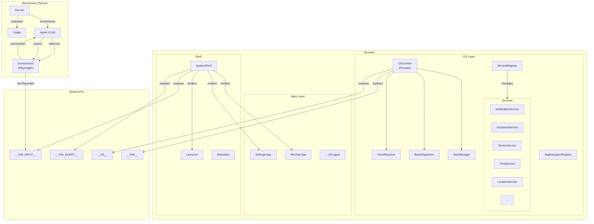

# P3 — 文档与国际化

> 优先级：**P3（生态建设）**
> 预计工作量：2 人 × 3 周
> 目标：完整的文档站 + 双语文档

---

## 1. 文档体系规划

### 1.1 现状评估

| 文档类型 | 现状 | 目标 |
|----------|------|------|
| README.md | 有，面向内部 | 重写为面向开源社区 |
| Quick Start | 无 | 5 分钟上手指南 |
| Architecture Guide | 分散在 CLAUDE.md/PROJECT_SPEC_V2.md | 统一架构文档 |
| API Reference | 无（globals.d.ts 有类型但无说明） | 完整 API 文档 |
| App Development Guide | 分散在 CLAUDE.md | 独立 App 开发指南 |
| Benchmark Guide | bench_env/README.md | 扩充为完整指南 |
| Contributing Guide | 无 | CONTRIBUTING.md |
| Changelog | 无 | 自动生成 |

### 1.2 文档架构

```
docs/                          # 源文件（VitePress）
├── index.md                   # Landing page
├── guide/
│   ├── getting-started.md     # Quick Start
│   ├── architecture.md        # 架构概览
│   ├── concepts.md            # 核心概念
│   └── configuration.md       # 配置说明
├── api/
│   ├── sim-api.md             # __SIM__ API
│   ├── os-api.md              # __OS__ API
│   ├── sim-input-api.md       # __SIM_INPUT__ API
│   ├── sim-query-api.md       # __SIM_QUERY__ API
│   ├── sim-time-api.md        # __SIM_TIME__ API
│   ├── sim-location-api.md    # __SIM_LOCATION__ API
│   ├── sim-fs-api.md          # __SIM_FS__ API
│   └── services.md            # 系统服务 API
├── apps/
│   ├── creating-an-app.md     # App 开发教程
│   ├── navigation.md          # 导航系统详解
│   ├── state-management.md    # 状态管理
│   ├── resources.md           # 资源系统（res/）
│   └── dom-tagging.md         # DOM 标记规范
├── benchmark/
│   ├── overview.md            # Benchmark 概述
│   ├── tasks.md               # 任务编写
│   ├── agents.md              # Agent 接入
│   ├── evaluation.md          # 评估方法
│   └── running.md             # 运行 Benchmark
├── contributing/
│   ├── index.md               # 贡献指南
│   ├── code-style.md          # 代码规范
│   └── pull-request.md        # PR 流程
└── changelog.md               # Changelog
```

---

## 2. README.md 重写

### 2.1 目标结构

```markdown
# Mobile-Gym

> A simulated Android OS environment for training and evaluating
> mobile phone operation agents.

[English](./README.md) | [中文](./README.zh-CN.md)

<!-- Badges -->
[]()
[]()
[]()

<!-- Demo GIF or screenshot -->


## Features

- 🖥️ Full Android OS simulation in the browser
- 📱 26 pre-built apps (messaging, payment, social media, ...)
- 🤖 JavaScript APIs for agent interaction (`__SIM__`, `__SIM_INPUT__`, ...)
- 📊 Comprehensive benchmark suite with state-based & VLM evaluation
- 🔌 Extensible: add your own apps and agents

## Quick Start

### Using Docker (recommended)

    docker run -p 3000:80 ghcr.io/<org>/mobile-gym:latest
    # Open http://localhost:3000

### From Source

    git clone https://github.com/<org>/mobile-gym
    cd mobile-gym
    cp .env.example .env    # Configure API keys (optional)
    npm install
    npm run dev             # → http://localhost:3000

### Running Benchmarks

    pip install -r bench_env/requirements.txt
    playwright install chromium
    python -m bench_env.run --list                    # List tasks
    python -m bench_env.run --task-id <id> \
      --env-url http://localhost:3000 --agent generic_v2

## Documentation

- [Architecture Guide](docs/guide/architecture.md)
- [API Reference](docs/api/)
- [Creating Apps](docs/apps/creating-an-app.md)
- [Benchmark Guide](docs/benchmark/)
- [Contributing](CONTRIBUTING.md)

## Agent API

| Global | Purpose |
|--------|---------|
| `__SIM__` | Simulator control (reset, getState, setState) |
| `__SIM_INPUT__` | Input simulation (tap, swipe, type, back, home) |
| `__SIM_QUERY__` | Element queries (getRectBySelector, getRectByTrigger) |
| `__OS__` | OS-level APIs (launch apps, notifications, ...) |

## Built-in Apps

| Category | Apps |
|----------|------|
| Communication | WeChat, SMS, Contacts |
| Social | RedBook, Reddit, X, Bilibili |
| Finance | Alipay |
| Productivity | Calendar, Clock, Notes, Calculator |
| Entertainment | Spotify, WechatReading |
| Utilities | Settings, Weather, Map, Browser, Gallery, FileManager |
| Travel | Railway12306 |
| Commerce | Ebay |
| Work | TencentMeeting |

## Citation

    @article{...,
      title={Mobile-Gym: ...},
      author={...},
      year={2026},
    }

## License

Apache License 2.0 — see [LICENSE](LICENSE).

## Disclaimer

This project is an academic research tool. All simulated applications are
created for research purposes only. See [full disclaimer](docs/DISCLAIMER.md).
```

### 2.2 需要准备的素材

- **Demo GIF**：录制 3-5 秒的模拟器运行画面
- **Architecture Diagram**：使用 Mermaid 或 Excalidraw 绘制
- **Badge URLs**：CI、License、Docker Hub

---

## 3. API Reference 详细规格

### 3.1 `__SIM__` API 文档示例

```markdown
# __SIM__ — Simulator Control API

The `__SIM__` API provides control over the simulator lifecycle.

## Methods

### `reset(seed?: number): void`

Resets the simulator to initial state. Clears localStorage,
resets all services, and reloads the page.

**Parameters:**
- `seed` (optional): Random seed for reproducible state

**Example:**
    window.__SIM__.reset();
    // Page will reload

**Note:** After calling reset(), wait for `DOMContentLoaded`
before accessing other APIs.

---

### `waitForData(appIds?: string[]): Promise<void>`

Ensures app data is loaded. Call this after reset() before
interacting with apps.

**Parameters:**
- `appIds` (optional): Specific apps to wait for. If empty, waits for all.

**Example:**
    await window.__SIM__.waitForData(['wechat', 'alipay']);

---

### `getState(): { os: Record<string, unknown>; apps: Record<string, unknown> }`

Returns a snapshot of the entire simulator state.

**Returns:** Object with `os` (system services state) and
`apps` (per-app Zustand store state)

**Example:**
    const state = window.__SIM__.getState();
    console.log(state.apps.wechat);  // WeChat app state
    console.log(state.os);           // System services state

---

### `setState(patch, options?): void`

Patches app state. Useful for setting up specific scenarios.

**Parameters:**
- `patch.apps`: Object mapping appId → partial state
- `options.deep` (default: false): Deep merge instead of shallow
- `options.reload` (default: false): Reload page after setting state

**Example:**
    window.__SIM__.setState({
      apps: {
        wechat: {
          currentUser: { name: "Test User" }
        }
      }
    }, { deep: true });
```

### 3.2 每个 API 需要文档化

| API | 方法数 | 优先级 |
|-----|--------|--------|
| `__SIM__` | 4 | 最高 |
| `__SIM_INPUT__` | 7 | 最高 |
| `__SIM_QUERY__` | 4 | 最高 |
| `__OS__`（顶层） | ~15 | 高 |
| `__OS__.notifications` | 6 | 中 |
| `__OS__.permissions` | 8 | 中 |
| `__OS__.clipboard` | 8 | 中 |
| `__OS__.keyboard` | 8 | 中 |
| `__OS__.device` | 8 | 中 |
| `__OS__.broadcast` | 3 | 中 |
| `__OS__.content` | 6 | 中 |
| `__SIM_TIME__` | 6 | 中 |
| `__SIM_LOCATION__` | 8 | 中 |
| `__SIM_FS__` | 15 | 低 |
| `__SIM_MEDIA__` | 7 | 低 |
| `__SIM_AI__` | 10 | 低 |

---

## 4. VitePress 文档站搭建

### 4.1 安装

```bash
npm install -D vitepress
```

### 4.2 `docs/.vitepress/config.ts`

```typescript
import { defineConfig } from 'vitepress';

export default defineConfig({
  title: 'Mobile-Gym',
  description: 'A simulated Android OS for mobile agent training',
  base: '/mobile-gym/',
  themeConfig: {
    logo: '/logo.svg',
    nav: [
      { text: 'Guide', link: '/guide/getting-started' },
      { text: 'API', link: '/api/sim-api' },
      { text: 'Benchmark', link: '/benchmark/overview' },
      {
        text: 'Links',
        items: [
          { text: 'GitHub', link: 'https://github.com/<org>/mobile-gym' },
          { text: 'Playground', link: 'https://demo.mobile-gym.dev' },
        ],
      },
    ],
    sidebar: {
      '/guide/': [
        {
          text: 'Introduction',
          items: [
            { text: 'Getting Started', link: '/guide/getting-started' },
            { text: 'Architecture', link: '/guide/architecture' },
            { text: 'Core Concepts', link: '/guide/concepts' },
            { text: 'Configuration', link: '/guide/configuration' },
          ],
        },
      ],
      '/api/': [
        {
          text: 'Simulator APIs',
          items: [
            { text: '__SIM__', link: '/api/sim-api' },
            { text: '__SIM_INPUT__', link: '/api/sim-input-api' },
            { text: '__SIM_QUERY__', link: '/api/sim-query-api' },
            { text: '__SIM_TIME__', link: '/api/sim-time-api' },
            { text: '__SIM_LOCATION__', link: '/api/sim-location-api' },
          ],
        },
        {
          text: 'OS APIs',
          items: [
            { text: '__OS__', link: '/api/os-api' },
            { text: 'System Services', link: '/api/services' },
          ],
        },
      ],
      '/apps/': [
        {
          text: 'App Development',
          items: [
            { text: 'Creating an App', link: '/apps/creating-an-app' },
            { text: 'Navigation', link: '/apps/navigation' },
            { text: 'State Management', link: '/apps/state-management' },
            { text: 'Resources', link: '/apps/resources' },
            { text: 'DOM Tagging', link: '/apps/dom-tagging' },
          ],
        },
      ],
      '/benchmark/': [
        {
          text: 'Benchmark',
          items: [
            { text: 'Overview', link: '/benchmark/overview' },
            { text: 'Writing Tasks', link: '/benchmark/tasks' },
            { text: 'Agent Integration', link: '/benchmark/agents' },
            { text: 'Evaluation', link: '/benchmark/evaluation' },
            { text: 'Running', link: '/benchmark/running' },
          ],
        },
      ],
    },
    socialLinks: [
      { icon: 'github', link: 'https://github.com/<org>/mobile-gym' },
    ],
    search: {
      provider: 'local',
    },
    footer: {
      message: 'Released under the Apache 2.0 License.',
    },
  },
});
```

### 4.3 部署

```yaml
# .github/workflows/docs.yml
name: Deploy Docs

on:
  push:
    branches: [main]
    paths:
      - 'docs/**'

jobs:
  deploy:
    runs-on: ubuntu-latest
    permissions:
      pages: write
      id-token: write
    steps:
      - uses: actions/checkout@v4
      - uses: actions/setup-node@v4
        with:
          node-version: 20
          cache: npm
      - run: npm ci
      - run: npx vitepress build docs
      - uses: actions/upload-pages-artifact@v3
        with:
          path: docs/.vitepress/dist
      - uses: actions/deploy-pages@v4
```

---

## 5. CONTRIBUTING.md

```markdown
# Contributing to Mobile-Gym

Thank you for your interest in contributing!

## Development Setup

1. Fork and clone the repository
2. `cp .env.example .env` (configure API keys if needed)
3. `npm install`
4. `npm run dev`

## Code Style

- We use ESLint + Prettier (run `npm run lint:fix` before committing)
- TypeScript strict mode is being progressively enabled
- Follow existing patterns in similar files

## Pull Request Process

1. Create a feature branch: `git checkout -b feat/my-feature`
2. Make your changes
3. Run checks: `npm run typecheck && npm run lint && npm test`
4. Commit using conventional commits: `feat(app): add new feature`
5. Push and create a PR against `dev`

## Adding a New App

    npm run create-app MyApp -- --id myapp

Then follow the [App Development Guide](docs/apps/creating-an-app.md).

## Adding Benchmark Tasks

See [Writing Tasks](docs/benchmark/tasks.md).

## Adding Agent Types

See [Agent Integration](docs/benchmark/agents.md).

## Reporting Issues

- Use the issue template
- Include steps to reproduce
- Include browser/OS information
- For benchmark issues, include the full command and output

## Code of Conduct

See [CODE_OF_CONDUCT.md](CODE_OF_CONDUCT.md).
```

---

## 6. 国际化策略

### 6.1 代码注释与文档

| 内容类型 | 当前语言 | 目标 |
|----------|---------|------|
| README.md | 中文 | 英文为主 + 中文版本 |
| CLAUDE.md | 中英混合 | 保持（面向 AI 工具） |
| 代码注释 | 中文为主 | 保持中文（内部注释） |
| 文档站 | — | 英文为主，关键页面双语 |
| App strings.ts | 中文 | 保持（模拟中文 Android） |
| App strings.en.ts | 英文 | 补齐所有 App |

### 6.2 README 双语

- `README.md`：英文（面向国际社区）
- `README.zh-CN.md`：中文（面向中文社区）
- 在两个文件顶部互相链接

### 6.3 文档站双语（Phase 3+）

VitePress 支持 i18n：

```typescript
// docs/.vitepress/config.ts
export default defineConfig({
  locales: {
    root: {
      label: 'English',
      lang: 'en',
    },
    zh: {
      label: '中文',
      lang: 'zh-CN',
      link: '/zh/',
    },
  },
});
```

初期建议：
- 英文为主（覆盖 100% 页面）
- 核心页面（Getting Started、Architecture、API Overview）提供中文版
- 其余中文页面按社区需求逐步补充

### 6.4 App 层 i18n 补齐

对 26 个 App 的 `strings.en.ts` 进行统一检查和补齐：

```bash
# 脚本：检查 strings.en.ts 覆盖率
for dir in apps/*/; do
  app=$(basename "$dir")
  zh="$dir/res/strings.ts"
  en="$dir/res/strings.en.ts"
  if [ -f "$zh" ] && [ ! -f "$en" ]; then
    echo "MISSING: $app/res/strings.en.ts"
  elif [ -f "$zh" ] && [ -f "$en" ]; then
    zh_keys=$(grep -c ":" "$zh" 2>/dev/null || echo 0)
    en_keys=$(grep -c ":" "$en" 2>/dev/null || echo 0)
    if [ "$en_keys" -lt "$zh_keys" ]; then
      echo "INCOMPLETE: $app ($en_keys/$zh_keys keys)"
    fi
  fi
done
```

---

## 7. 架构图

### 7.1 Mermaid 系统架构图

````markdown

````

将此 Mermaid 图嵌入文档站的 Architecture 页面。

---

## 检查清单

- [ ] README.md 英文版重写
- [ ] README.zh-CN.md 中文版保留/更新
- [ ] CONTRIBUTING.md 创建
- [ ] CODE_OF_CONDUCT.md 创建
- [ ] VitePress 安装和配置
- [ ] Getting Started 文档编写
- [ ] Architecture Guide 编写（含 Mermaid 图）
- [ ] `__SIM__` API Reference 编写
- [ ] `__SIM_INPUT__` API Reference 编写
- [ ] `__SIM_QUERY__` API Reference 编写
- [ ] `__OS__` API Reference 编写
- [ ] App Development Guide 编写
- [ ] Benchmark Guide 扩充
- [ ] 文档站 CI/CD 部署
- [ ] Demo GIF 录制
- [ ] App `strings.en.ts` 全量覆盖检查
- [ ] 缺失的 `strings.en.ts` 补齐
